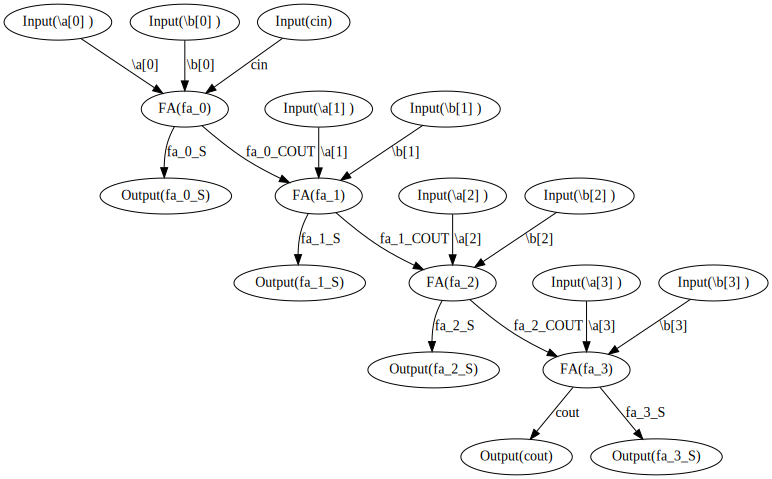

[](https://matth2k.github.io/safety-net/)

# Safety Net: A Memory-Safe Netlist Data Structure via Reference Counting

## Description

A Rust library for compiling and mutating Safety Net netlists in a memory-safe way

You can read the docs [here](https://matth2k.github.io/safety-net/).

## Getting Started

Below is a minimal example to get you started:

```rust
use safety_net::netlist::{Gate, Netlist};

fn and_gate() -> Gate {
    Gate::new_logical(
        "AND".into(),
        vec!["A".to_string(), "B".to_string()],
        "Y".to_string(),
    )
}

fn main() {
    let netlist = Netlist::new("example".to_string());

    // Add the the two inputs
    let a = netlist.insert_input("a".into());
    let b = netlist.insert_input("b".into());

    // Instantiate an AND gate
    let instance = netlist
        .insert_gate(and_gate(), "inst_0".into(), &[a, b])
        .unwrap();

    // Make this AND gate an output
    instance.expose_with_name("y".into());

    // Print the netlist
    println!("{netlist}");
}
```

This code is included in the crate and you can run it with `cargo run --example simple`. Of course, you should generate the documentation with `cargo doc` and give it a review.

## Exporting to MultiDiGraph with the petgraph Crate

The API provides the basic iterators needed to implement graph algorithms like static timing analysis:

- `iter()` (The circuit nodes)
- `connections()` (The edges)
- `dfs()` (Depth-first search)

However, you may want to use another library that leverages a denser representation and already has all the classic algorithms implemented. This crate provides integration with petgraph. Here is a ripple-carry adder example which converts the netlist to a petgraph which is then converted to a dot graph:

`cargo run --example connections | dot -Tsvg > adder.svg`

Then, open it up and take a look:


