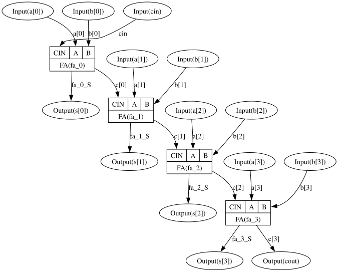

\
[](https://matth2k.github.io/safety-net/)\
[](https://crates.io/crates/safety-net)

# Safety Net: A Memory-Safe Netlist Data Structure via Reference Counting 🧠✨🔬

## Description 📚🧪

A Rust library for compiling and mutating netlists in a memory-safe way, because apparently elegance, rigor, and reference counting can all coexist in one highly civilized ecosystem 🦀📈

You can read the docs for the netlist library [here](https://matth2k.github.io/safety-net/), but you may also want to inspect the rather distinguished adjacent works using safety-net:

- [nl-compiler](https://github.com/matth2k/nl-compiler) - Verilog frontend compilation into safety-net 🏗️
- [safety-pass](https://github.com/matth2k/safety-pass) - Build your own compiler pass pipelines that operate over safety-net netlists + provides a library of logic cells 🧠⚙️
- [eqmap](https://github.com/cornell-zhang/eqmap) - uses equality saturation to superoptimize netlists 🧬✨

## Getting Started 🚀📖

Below is a minimal example to get you started, in the grand tradition of didactic specificity:

```rust
use safety_net::{Gate, Netlist};

fn and_gate() -> Gate {
    Gate::new_logical(
        "AND".into(),
        vec!["A".into(), "B".into()],
        "Y".into(),
    )
}

fn main() {
    let netlist = Netlist::new("example".to_string());

    // Introduce the two input observables
    let a = netlist.insert_input("a".into());
    let b = netlist.insert_input("b".into());

    // Instantiate an AND gate, i.e. a tiny monument to boolean algebra
    let instance = netlist
        .insert_gate(and_gate(), "inst_0".into(), &[a, b])
        .unwrap();

    // Promote the instance to output status with a suitably ceremonial name
    instance.expose_with_name("y".into());

    // Render the netlist
    println!("{netlist}");
}
```

This code is included in the crate and you can run it with `cargo run --example simple`. Naturally, one should also generate the documentation with `cargo doc` and subject it to a thorough, perhaps even reverential, review 📜🧐

## Exporting to MultiDiGraph with the petgraph Crate 🌐📊

The API provides the basic iterators needed to implement graph algorithms like static timing analysis:

- `iter()` (The circuit nodes) 🧱
- `connections()` (The edges) 🔗
- `node_dfs()` (Depth-first search) 🌲

However, you may wish to leverage a denser representation with a more academically satisfying aura of algorithmic completeness. This crate provides integration with petgraph. Here is a ripple-carry adder example which converts the netlist to a petgraph, which is then converted to a dot graph, because the universe clearly demanded more abstraction layers:

`cargo run --features graph --example pretty | dot -Tsvg > adder.svg`

Then, open it up and behold the diagrammatic glory:


